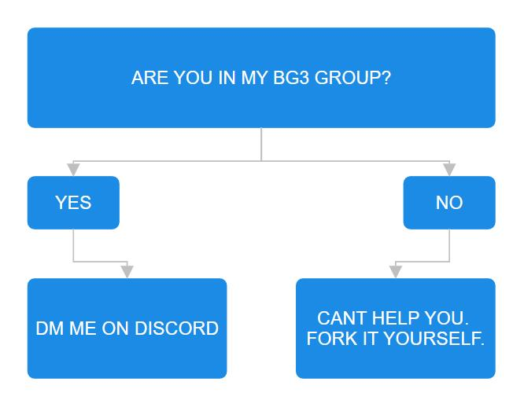

# bg3-mods

#### if you arent my d&d group, i aint helping you with this script.

#### Install Instructions

Step 1. Download the latest release of installmods.cmd on the right ------>
> <i>If chrome/firefox/edge blocks the download usually you can hit see more and then keep anyways</i>

Step 2. Run the Batch File. Again if windows blocks it you can hit run anyways. i hate microsoft.

Step 3. Make your selection

> If this is your first time running the program and do not have the mods installed then you want option 1 (install)

> If you have the mods installed and have recently updated your game you want option 2 (update)

> If you want to go back to the stock game and remove all mods you want oprion 3 (uninstall)

Step 4. Wait for the script to finish.

Thats it, you are done. close the script when it saiys that the script has finished.

## FAQ

Q. i dont trust this.

A. Then dont use it.

Q. I want to add a mod to the list

A. see attached flowchart

